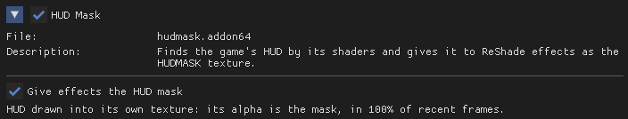
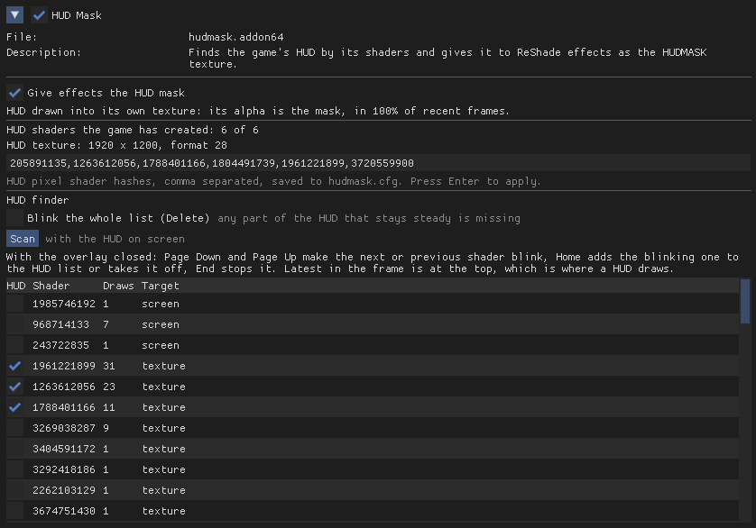

# HUD Mask

ReShade add-on that finds a game's HUD by its pixel shaders and exposes it to
effects as a texture (`HUDMASK`). Effects that read it can skip the HUD, both
when processing and when metering the scene. Effects that don't read it behave
exactly as before. Works with SDR and HDR swap chains.

Which shaders make up the HUD is per game, stored in `hudmask.cfg` next to the
add-on. Debug mode has a finder for building that list.

## How it works

Alpha of `HUDMASK` is HUD coverage. Games draw the HUD in one of two ways, and
the add-on detects which from where the HUD shaders render:

- **Into a separate texture** that gets composited in the last pass of the
  frame. That texture is used as the mask directly, including partial alpha for
  translucent panels. Some games skip redrawing it on some frames, so the last
  one is held for about half a second before the mask is cleared.
- **Straight onto the back buffer.** The frame is copied right before the first
  HUD draw and compared with the finished frame. Any pixel that changed is HUD.
  Translucent panels come out as fully covered, since a difference can't tell
  you how transparent something was. D3D11 and D3D12 only.

## Reading the mask in an effect

```
texture HudMask : HUDMASK;
sampler sHudMask { Texture = HudMask; };
```

When the add-on isn't loaded, or there's no HUD this frame, ReShade binds a 1x1
placeholder whose alpha reads as 1. Check the size first:

```
float HudCover(float2 uv)
{
    if (tex2Dsize(sHudMask).x < 2)
        return 0.0;
    return saturate(tex2Dlod(sHudMask, float4(uv, 0.0, 0.0)).a);
}
```

[PHDRPlus](https://github.com/danyalziakhan/dz-shaders/blob/main/Shaders/PHDRPlus.fx)
uses it in two places: eye adaptation substitutes last frame's level under the
HUD, and the final pass restores the original pixels where the HUD is.

From 0.3, another add-on in the same process can ask for the HUD directly,
which is how [HDR Bridge](https://github.com/danyalziakhan/hdrbridge) protects
it. Find the export with `GetProcAddress` and call it once a frame, at
`present` or later:

```
int hudmask_frame_texture(void *device, uint64_t *srv);
```

It returns 1 with a shader resource view of this frame's HUD texture, or the
one held over a frame the game skipped, whichever add-on's `present` callback
runs first; 2 when the HUD is drawn onto the back
buffer, whose mask is only built after `present`; and 0 when there is no HUD or
the add-on is off. `device` is the `reshade::api::device` both share. The view
belongs to HUD Mask and is good for the current frame only.

`shaders\HudMaskView.fx` draws the mask in red over a darkened frame. Handy for
checking a shader list: the HUD should be red, nothing else.

## Installing

Get it from [Nexus Mods](https://www.nexusmods.com/site/mods/2380) or build it
yourself (see below). Needs ReShade 6.8+ with add-on support.

1. Put `hudmask.addon64` next to the game's executable, where ReShade's DLL is.
   Add the game's `hudmask.cfg` too if you have one.
2. In `ReShade.ini`, under `[ADDON]`, add it to `LoadFromDllMain`. It has to be
   loaded before the game creates its HUD shaders. Separate multiple add-ons
   with commas:

```
LoadFromDllMain=hudmask.addon64
```

## hudmask.cfg

```
# Name of the game
HudShaders=1234567890,2345678901
```

Each entry is the CRC-32 of a pixel shader's bytecode. That's the same hash
ShaderToggler uses, so its HUD groups can be pasted in as-is. `#` lines are
comments and survive when the finder rewrites the file.

## Settings

The panel in the Add-ons tab has a single toggle, **Give effects the HUD mask**,
plus a status line showing which path the game uses and how often the HUD was
seen recently. If that stays at 0% in gameplay, the shader list doesn't match.



## Finding a game's HUD

Enable debug mode in the game's `ReShade.ini`:

```
[HUDMASK]
Debug=1
```



With the HUD visible, hit **Scan**. It collects every pixel shader drawing to a
screen-sized target over about a second, latest in the frame first (HUD usually
draws last). Close the overlay and step through:

- **Page Down / Page Up**: blink the next / previous shader
- **Home**: add the blinking shader to the list, or remove it
- **End**: stop blinking
- **Delete**: blink everything in the list

If part of the HUD blinks, add it. A HUD is usually several shaders (text,
icons, bars, minimap). Skip anything that also blinks parts of the scene. Use
Delete at the end to see what's still missing. Changes go straight to
`hudmask.cfg`.

**Log one frame** is the quicker route once you have one HUD shader. It dumps a
single frame to the panel and `ReShade.log`:

- which path the game uses, plus the HUD texture's size and format
- listed shaders that didn't draw, or drew somewhere unexpected
- unlisted shaders drawing where the HUD goes (into the HUD texture, or onto the
  back buffer after the first HUD draw). With a HUD texture, these are nearly
  always HUD.

Click a suggestion to blink it, tick it to add it, or add them all.

## Building

Visual Studio 2022 and CMake. Clone the dependencies into `deps` first, from the
repository root:

```
git clone --depth 1 --branch v6.8.0 https://github.com/crosire/reshade.git deps\reshade
```

ReShade passes its own ImGui functions to add-ons, so the ImGui commit has to
match the one ReShade pins. To print it:

```
git -C deps\reshade ls-tree HEAD deps/imgui
```

For v6.8.0 it's `3912b3d9a9c1b3f17431aebafd86d2f40ee6e59c`:

```
git clone https://github.com/ocornut/imgui.git deps\imgui
```
```
git -C deps\imgui checkout 3912b3d9a9c1b3f17431aebafd86d2f40ee6e59c
```

Then:

```
cmake -S . -B build -G "Visual Studio 17 2022" -A x64
```
```
cmake --build build --config Release
```

Output: `build\Release\hudmask.addon64`.

## Acknowledgements

[ReshadeEffectShaderToggler](https://github.com/4lex4nder/ReshadeEffectShaderToggler)
was the inspiration for finding a game's shaders by their hashes. I chose to
build my own because I wanted something very simple, that does one job and is
not prone to bugs or crashes.

## Development note

AI assistance was used during development, for reviewing code, finding bugs,
refining the implementation and writing documentation. All changes were reviewed
and tested before being included.

## License

MIT
